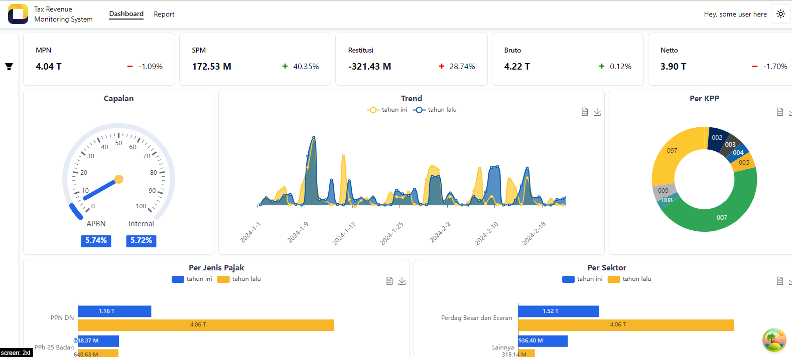

### Tax Revenue Monitoring System

##### on Development

Useful Resources to make this app:

- https://www.youtube.com/watch?v=Xa73Xr8PM2k&t=6698s
  SELECT
  m.datebayar,
  SUM(CASE WHEN EXTRACT(YEAR FROM n.datebayar) = 2024 AND n.datebayar <= m.datebayar THEN n.nominal END) AS cy_trend,
  SUM(CASE WHEN EXTRACT(YEAR FROM n.datebayar) = 2023 AND n.datebayar <= m.datebayar THEN n.nominal END) AS py_trend
  FROM mpn m
  LEFT JOIN (
  SELECT datebayar ,
  sum(nominal) AS nominal
  FROM mpn  
   group by datebayar )n
  ON m.datebayar >=n.datebayar
  GROUP BY m.datebayar
  ORDER BY m.datebayar ASC
